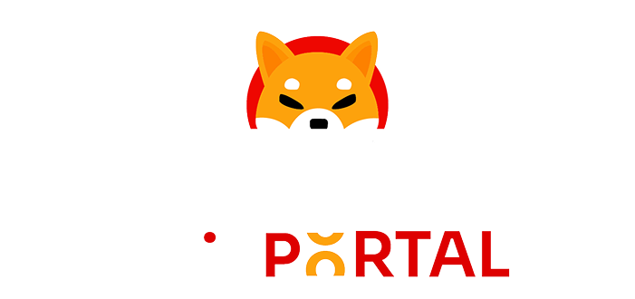
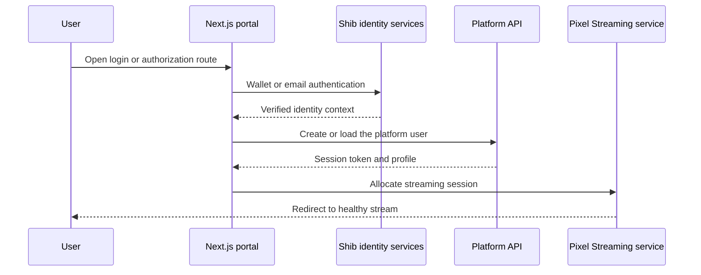

# Shib Portal Frontend

<p align="center">
  
</p>

Shib Portal Frontend is the browser-facing identity and streaming bridge for Shib: The Metaverse. It coordinates wallet and passwordless-email sign-in, Shib identity onboarding, token handoff, user-profile creation, and the lifecycle of a Pixel Streaming session.

The project is intentionally focused: the root route exposes no general marketing surface. Instead, purpose-built routes support authentication callbacks, desktop-launcher integration, user information, and browser streaming.

## Engineering highlights

- Wallet and passwordless-email authentication through the Shib identity stack
- Nonce-based wallet verification and signed authentication flows
- New-user onboarding with debounced username availability checks
- Token-aware redirects back to the launcher or into a streaming session
- Pixel Streaming allocation, health polling, browser handoff, and session termination
- Authenticated API wrapper with centralized bearer-token handling
- Service worker registration for the portal experience
- Reusable loading, error, and action components
- Container-ready production runtime with environment-specific encrypted configuration

## Request flow



## Application routes

| Route | Responsibility |
| --- | --- |
| `/login` | Wallet/email login, onboarding, username checks, and launcher or stream redirect |
| `/authorize` | Authorization bridge for connected clients |
| `/stream` | Streaming-session creation, readiness polling, redirection, and cleanup |
| `/userinfo` | Server route that resolves authenticated user information |
| `/` | Closed entry point for direct navigation |

## Technology

- Next.js 15 App Router
- React 18 and TypeScript
- Shib Auth, Identity, Account Abstraction, and shared UI SDKs
- ethers 6
- CSS Modules and optimized static assets
- Docker, Make, AWS KMS-backed environment delivery, and a non-root runtime image

## Repository map

| Path | Responsibility |
| --- | --- |
| `app/` | Route-level login, authorization, streaming, user-info, and error experiences |
| `components/` | Authentication wrapper, buttons, loading states, and error dialogs |
| `hooks/useSecurity.tsx` | Identity state, nonce exchange, token handling, and sign-out behavior |
| `utils/` | Authenticated network clients and time formatting |
| `public/` | Portal branding, streaming artwork, service worker, and shared media |
| `Dockerfile` | Hardened production runtime image |
| `Makefile` | Dependency, environment-encryption, build, and container workflows |

## Local development

### Prerequisites

- Node.js 20 or newer
- npm access to the private `@shibaone` GitHub Packages scope
- Team-provided environment values for identity, API, and streaming services

Copy `.npmrc.example` to your user-level or project npm configuration, replace the placeholder with an authorized package token, and keep the resulting file out of version control.

```bash
npm install
npm run dev
```

The development server is available at `http://localhost:3000`. Before sharing a change, run:

```bash
npm run build
```

Production packaging expects the encrypted environment artifacts used by `entrypoint.sh`; they are managed outside this portfolio snapshot.

## Ecosystem context

This portal is the browser boundary of the wider [Shib: The Metaverse](https://github.com/Elia-Youssef/ShibTheMetaverse) platform. The [desktop launcher](https://github.com/Elia-Youssef/ShibPortal-Desktop) consumes its authentication flow, while the [platform backend](https://github.com/Elia-Youssef/Shib-Backend) supplies user and service data. See the complete experience in the [Rebel Art Studios case study](https://rebelartstudios.org/project/shib-the-metaverse).

## Ownership and licensing

This repository has no open-source license. Unless a separate agreement grants permission, its source and assets are provided for authorized development and portfolio reference only.
